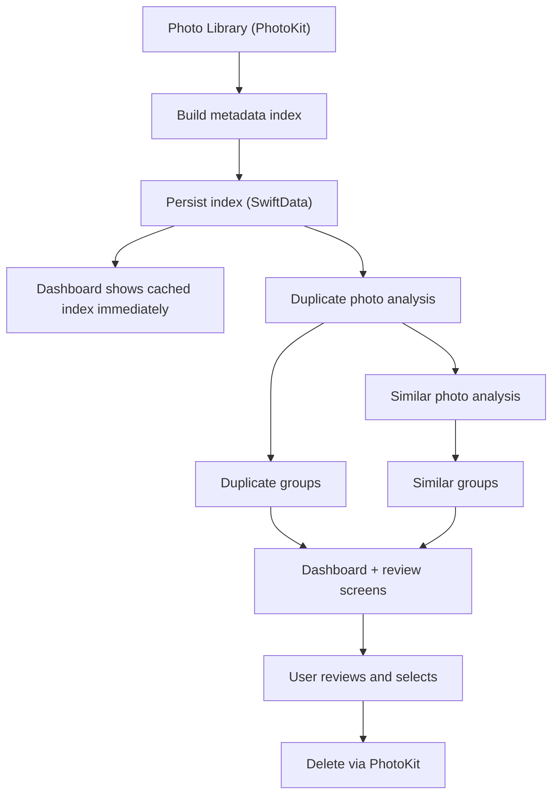
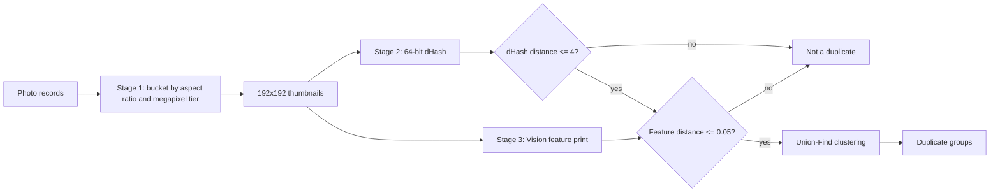
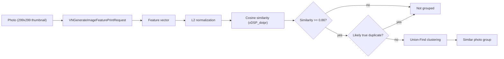
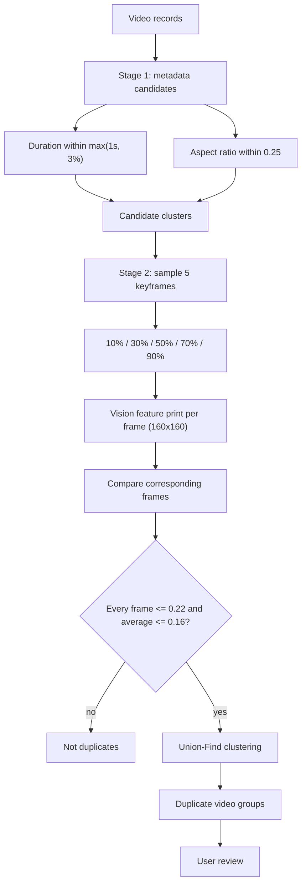
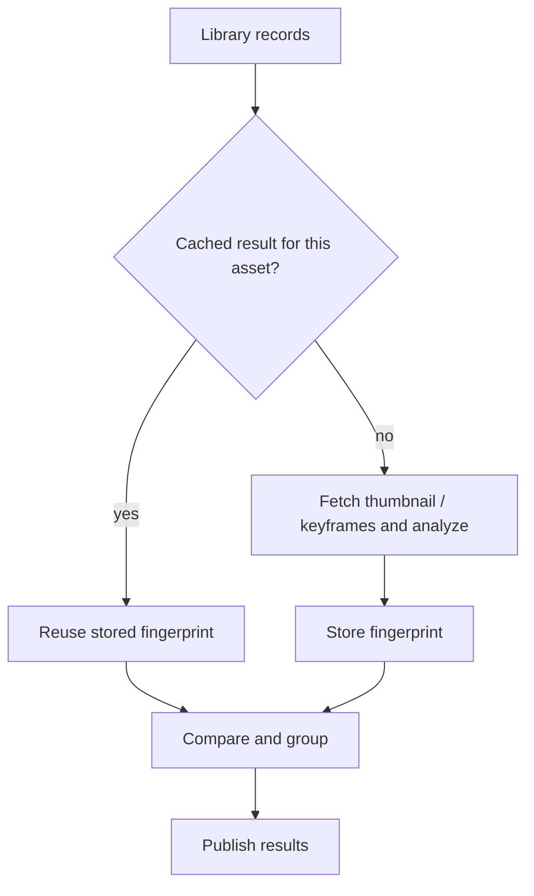
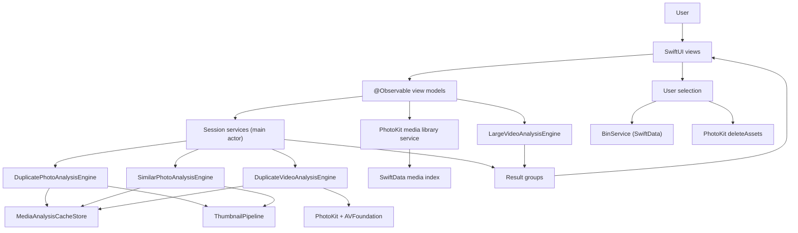
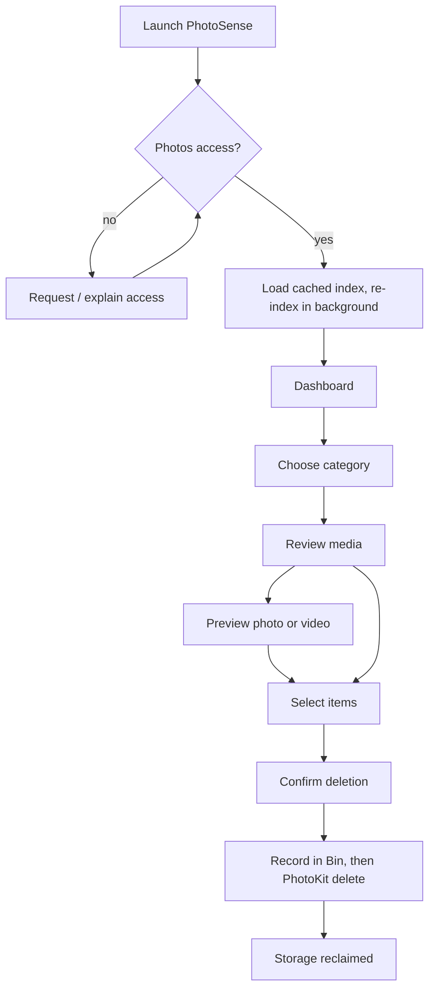
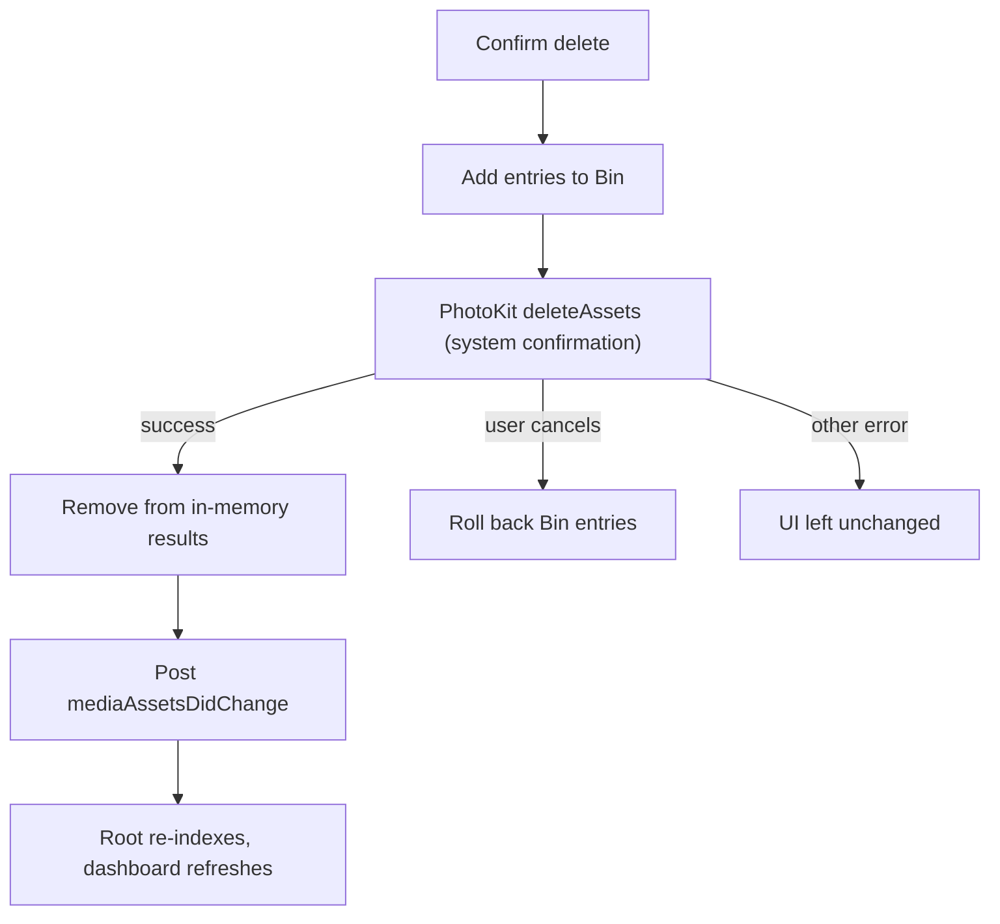

# PhotoSense


PhotoSense is a native iOS app for cleaning up a photo library. It indexes the library, runs several media-analysis passes, and groups likely-removable media into categories: duplicate photos, similar photos, duplicate videos, and large videos. Deleted items are tracked in an in-app Bin.

It is more than a gallery UI. Each category uses a different technique (metadata bucketing, perceptual hashing, Vision feature prints, keyframe sampling, file-size ranking), and the app caches results so unchanged media is not reprocessed.

## Overview

PhotoSense reads the Photos library through PhotoKit and builds a lightweight metadata index (dimensions, duration, resource types, file size where available). Analysis engines run on top of that index in the background and publish results to the dashboard. From there you can review each category, preview items full screen, select what to remove, and delete through PhotoKit.

## Key Features

- **Duplicate photo detection**: near-identical copies found with metadata bucketing, a 64-bit perceptual hash (dHash), and Vision feature-print verification.
- **Similar photo detection**: different shots of the same scene, found by cosine similarity over Vision feature-print embeddings.
- **Duplicate video detection**: duration/aspect-ratio candidate matching, then verification on 5 sampled keyframes with Vision feature prints.
- **Large video discovery**: videos ranked by file size, with a "Largest 15%" view and size filters.
- **Screenshots and Videos browsers**: plain grids over indexed screenshots and videos.
- **Full-screen preview**: paged gallery for photos and videos, with swipe-down to dismiss and delete from preview.
- **Storage overview**: dashboard bar with the total cleanable space across analyzed categories.
- **Selective deletion**: multi-select (long-press or Select), "Select Duplicates (Keep Best)" helpers, and a confirmation step.
- **Bin**: items deleted through PhotoSense are recorded for 30 days and expired entries are purged automatically.
- **Cached analysis**: fingerprints are cached so unchanged assets are not re-analyzed.
- **Appearance**: the UI uses system semantic colors and follows the device's Light/Dark setting.
- **Limited Photos access**: handled; only the assets the user shares are indexed.

## How PhotoSense Works

### Photo Analysis Pipeline



1. **Index.** `MediaIndexingService` builds a `MediaAssetIndexRecord` per asset (kind, pixel size, duration, creation date, resource types, file size when known). The index is stored through a SwiftData-backed store.
2. **Fast launch.** The dashboard loads the cached index first, then re-indexes in the background and updates when finished.
3. **Analysis.** Once records are available, the duplicate-photo, duplicate-video, and similar-photo session services start automatically. Similar-photo analysis is triggered after duplicate-photo analysis completes.
4. **Review.** Results appear on the dashboard and in each category screen.

### Exact Duplicate Detection

Duplicates are found by comparing image **content**, not filenames. The implementation in `DuplicatePhotoAnalysisEngine` does not hash file bytes (no MD5/SHA). It uses a perceptual fingerprint plus a Vision check, so it matches the same image even after re-encoding. In this README, "duplicate" means identical or re-encoded copies of one image.



| Stage | What it does |
|---|---|
| 1. Bucketing | Groups photos by orientation-independent aspect ratio (rounded to 2 decimals) and megapixel tier. Only buckets with 2 or more photos are examined. No image data is read at this stage. |
| 2. dHash | Draws a 9×8 grayscale rendering of the thumbnail and sets one bit per adjacent-pixel comparison, producing a 64-bit hash. Hashes are compared with Hamming distance. |
| 3. Vision verification | Computes a `VNFeaturePrintObservation` and compares distances. |
| Match rule | dHash Hamming distance ≤ 4 **and** Vision distance ≤ 0.05. |
| Grouping | Matching pairs are merged with Union-Find. The "Best" copy is the largest file, with pixel count as tie-breaker. |

A perceptual hash is a fingerprint that changes little when the image changes little, unlike a cryptographic hash, which changes completely on any byte difference. Comparing short fingerprints is much cheaper than comparing images.

Because of the bucketing stage, a resized or cropped copy lands in a different bucket and is not matched as a duplicate.

### Similar Photo Detection

Similar photos are different images with visually similar content, such as burst shots or the same scene in slightly different poses. They are not pixel-level matches.



- Vision's `VNGenerateImageFeaturePrintRequest` produces a feature representation for each image. The engine copies it into a float vector and normalizes it to unit length.
- For unit vectors, cosine similarity is the dot product, computed with Accelerate's `vDSP_dotpr`.
- Defaults live in `SimilarPhotoConfiguration`:

| Parameter | Default | Meaning |
|---|---|---|
| `similarityThreshold` | 0.86 | Minimum cosine similarity to be considered similar |
| `duplicateCosineCeiling` | 0.985 | At or above this, a pair is a duplicate candidate |
| `maxDuplicateDHashDistance` | 4 | Pairs above the ceiling with dHash ≤ 4 are excluded as duplicates |
| `maxAspectRatioDivergence` | 0.35 | Skips pairs with very different compositions |
| `featureTargetSize` | 299×299 | Thumbnail size fed to Vision |
| `concurrencyLimit` | 8 | Thumbnail fetches per batch |

- The engine also accepts a set of asset IDs already identified as duplicates and excludes them.
- Pairs that pass are clustered with Union-Find. Each group stores its average pairwise similarity, and the representative is the highest-resolution photo.

**Exact vs. similar:** duplicate detection asks "is this the same image?" with strict thresholds. Similar detection asks "do these show the same kind of content?" with a looser similarity score.

### Video Analysis

Duplicate videos use two stages. There is no file-hash comparison.



- **Stage 1** uses only metadata. Videos are sorted by duration and linked when their durations are close and their aspect ratios are similar. Nothing is decoded here.
- **Stage 2** extracts frames at 10%, 30%, 50%, 70%, and 90% of the duration with `AVAssetImageGenerator`, at a maximum of 160×160. Each frame gets a Vision feature print.
- At least 4 of the 5 frames must fingerprint successfully. Corresponding frames are compared, and a pair is accepted only if **every** compared frame is within 0.22 and the **average** is within 0.16.
- Matches are clustered and the "Best" video is the highest resolution, then the largest file.

Sampling five frames is a much cheaper way to get representative visual evidence than comparing every frame. It is still an approximation, and the review screen exists so you can confirm matches before deleting. Frame extraction runs with network access disabled, so videos not available on the device are skipped.

### Large Video Detection

Large videos are found by **file size only**, not by content analysis.

- Each video's file size is resolved (from the index, or fetched from the media library). If no size can be obtained, an estimate of about 2.5 MB per second of duration is used.
- Videos are sorted largest first and ranked.
- The default view shows the largest 15% (at least one video). An "All Videos" mode shows the full ranking.
- Size filters: **All**, **100 MB+**, **500 MB+**, **1 GB+**, **2 GB+**.

The separate Videos screen has its own filters: All, < 100 MB, < 500 MB, < 1 GB, > 1 GB.

### Caching & Performance



Caching exists at three levels in the code:

| Level | Where | What it avoids |
|---|---|---|
| Persistent fingerprint cache | `MediaAnalysisCacheStore` (used by all three engines) | Re-extracting dHash/feature prints (photos), feature-print vectors (similar photos), and keyframe feature prints (videos) for unchanged assets |
| In-memory feature cache | `SimilarPhotoFeatureCache` | Re-running Vision extraction when navigating between screens |
| Session services | `DuplicatePhotosSessionService`, `DuplicateVideosSessionService`, `SimilarPhotosSessionService` | Re-running a whole analysis for the same set of records in one app session |

After each re-index, the cache is pruned to the asset IDs that still exist. A "Re-scan" button forces a fresh analysis.

## Technical Architecture



The structure is MVVM with an actor-based analysis layer:

- **Views** render state only.
- **View models** (`@MainActor @Observable`) handle selection and deletion.
- **Session services** own analysis state for the app session and are shared by the dashboard and detail screens.
- **Engines** are actors that do the heavy work.

## End-to-End Workflow



What happens at deletion:



## Detection Techniques

| Feature | Technique | Purpose |
|---|---|---|
| Duplicate photos | Metadata bucketing, dHash (Hamming ≤ 4), Vision feature-print distance (≤ 0.05) | Find identical or re-encoded copies |
| Similar photos | Vision feature prints, L2 normalization, cosine similarity (≥ 0.86) | Find visually similar shots |
| Duplicate videos | Duration/aspect-ratio bucketing, 5 sampled keyframes, Vision feature prints (each ≤ 0.22, average ≤ 0.16) | Find duplicate videos |
| Large videos | File-size ranking (top 15%) and size filters | Find storage-heavy videos |
| Performance | Persistent fingerprint cache, in-memory feature cache, session-level reuse | Avoid reprocessing unchanged media |

## Why These Techniques?

- **A cheap pre-filter comes first.** Metadata bucketing removes most pairs before any pixels are read.
- **Duplicates and similar photos are different problems.** Duplicates need a strict test (hash plus a tight Vision distance). Similar shots need a graded score, which is what cosine similarity over embeddings gives.
- **Video is sampled, not fully compared.** Comparing every frame of every candidate pair is impractical on a phone. Five representative frames give usable evidence at a fraction of the cost.
- **File size needs no analysis.** Finding storage-heavy videos is a sorting problem.
- **Caching keeps the expensive parts one-time.** Fingerprints are computed once per asset and reused.

## Project Structure

The sources are grouped here by responsibility.

```
PhotoSense/
├── App
│   ├── PhotoSenseApp.swift              # @main entry point
│   ├── ContentView.swift                # NavigationStack root, library-change listener
│   └── RootStatusView.swift             # Auth / indexing / ready / failed states
├── Analysis engines (actors)
│   ├── DuplicatePhotoAnalysisEngine.swift
│   ├── SimilarPhotoAnalysisEngine.swift
│   ├── DuplicateVideoAnalysisEngine.swift
│   └── LargeVideoAnalysisEngine.swift
├── Session services (shared analysis state)
│   ├── DuplicatePhotosSessionService.swift
│   ├── DuplicateVideosSessionService.swift
│   └── DashboardService.swift           # Builds DashboardSnapshot
├── View models
│   ├── RootViewModel.swift
│   ├── MediaCategoryViewModel.swift     # Screenshots, Videos
│   ├── DuplicatePhotosViewModel.swift
│   ├── SimilarPhotosViewModel.swift
│   ├── DuplicateVideosViewModel.swift
│   ├── LargeVideosViewModel.swift
│   └── BinViewModel.swift
├── Models
│   ├── MediaAssetIndexRecord.swift, MediaLibraryAsset.swift
│   ├── MediaResourceDescriptor.swift, MediaAssetKind.swift
│   ├── MediaIndexSnapshot.swift, DashboardSnapshot.swift
│   ├── SimilarPhotoGroup.swift, VideoAssetItem.swift
│   ├── BinRecord.swift (SwiftData), BinEntry.swift
│   └── DashboardCategory.swift, MediaLibraryAuthorizationStatus.swift
└── Views
    ├── DashboardView.swift, LibraryStorageBarView.swift, CategoryNavigationRow.swift
    ├── DuplicatePhotosView.swift, SimilarPhotosView.swift, DuplicateVideosView.swift
    ├── LargeVideosView.swift, ScreenshotsView.swift, VideosView.swift, BinView.swift
    ├── MediaGalleryPreviewView.swift    # Full-screen paged preview
    ├── MediaThumbnailCell.swift, AssetThumbnailView.swift, LargeVideoCardView.swift
    ├── SizeFilterBar.swift, ConsistentEmptyStateView.swift
    └── PhotoSenseTheme.swift            # Colors, radii, spacing, animations
```

Key responsibilities:

- **Engines** hold the algorithms. Each has a protocol (`DuplicatePhotoAnalyzing`, etc.) so it can be swapped or tested.
- **Session services** make analysis run once per app session. Each uses a key built from the records and a revision counter that discards stale or cancelled runs. They also update results in place after deletions, so no re-analysis is needed.
- **`DashboardService`** merges index counts, session states, and Bin count into a `DashboardSnapshot`.
- **`MediaGalleryPreviewView`** wraps `UIPageViewController` for paging, loads a thumbnail first and upgrades to a full-quality image, and creates an `AVPlayer` only for the active video page.

## Performance Considerations

Gallery analysis is expensive. The code addresses it in these ways:

- **Large libraries:** metadata bucketing and the persistent index avoid examining every pair or every file.
- **Feature extraction:** small thumbnails are used (192×192 for duplicate photos, 299×299 for similar photos, 160×160 for video keyframes).
- **Video processing:** only five frames per candidate video are decoded, and only for videos that pass the metadata filter.
- **Memory:** thumbnail fetching runs in bounded batches (10 for duplicate photos, 8 for similar photos and large-video size resolution), and video frame work uses `autoreleasepool`.
- **Repeated work:** the cache layers above, plus lazy file-size lookup (sizes are resolved for confirmed groups, not every asset).
- **Concurrency:** engines are actors, work is chunked with cancellation checks and `Task.yield()`, and the UI stays on the main actor.
- **Scanning experience:** the cached dashboard appears first, analysis runs in the background with "Analyzing" indicators, grids are lazy, and stale analysis tasks are ignored via the revision counter.

## Privacy

Based on the source code:

- Analysis uses Apple's on-device frameworks (Vision, AVFoundation, PhotoKit, Accelerate). The code contains no networking code and no server or cloud service.
- Fingerprints and the media index are stored locally (SwiftData and the analysis cache). The Bin stores thumbnail data and file sizes locally.
- Gallery preview and thumbnail requests may use PhotoKit with network access allowed, so iCloud-stored originals can be downloaded by the system when previewed. Video keyframe extraction for duplicate analysis disables network access.
- The app requires Photos access and works with Limited access.

This describes the code as written. It is not a legal or privacy guarantee.

## Requirements

- iOS 17 or later (the code uses `@Observable`, SwiftData, and `ContentUnavailableView`).
- A recent Xcode with Swift 5.10 or newer.
- A photo library with content to analyze. Video keyframe analysis needs videos that are available on the device.

## Getting Started

1. Clone the repository and open the Xcode project.
2. Select an iOS 17+ simulator or a connected device.
3. Make sure the target's Info.plist includes the Photos usage description (`NSPhotoLibraryUsageDescription`).
4. Build and run, then grant Photos access when prompted. A real device with a real library gives the most meaningful results.

## Future Improvements

These are ideas, not current features:

- Restoring items from the Bin back to the library (the current Bin screen only removes entries).
- Tuning the duplicate and similarity thresholds against real libraries and exposing them as settings.
- Matching duplicates across different resolutions, which the current bucketing stage excludes.
- Optional byte-level file hashing as an additional exact-match signal.
